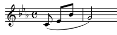
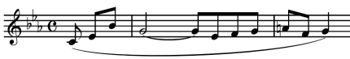

========
曲目解説
========

2011年度全日本吹奏楽コンクール課題曲より(宮島)
==============================================

課題曲I マーチ「ライブリー アヴェニュー」
------------------------------------------
:作曲: 堀田庸元

第21回朝日作曲賞(朝日新聞社と全日本吹奏楽連盟が主催する吹奏楽曲の作曲コンクール)受賞。

連盟のHPにある冒頭1分間試聴を聞いただけの印象。

いわゆる「マーチテンポ」よりも少し早いテンポで演奏されている。楽器の配置というのか、どの楽器がどの役割をというのは、これもいわゆる基本の配置のようだ。

発音をしっかり揃え、音の終わりをきちんと処理しないといけないということを(いわゆるタテ線問題)をしっかり詰めるにはいい曲だと思う。

試聴で聞ける部分の後には、トリオとか、ラストの部分を繋ぐファンファーレ的なものとか、きっとあるんだろう。とはいえ、「いつもどおり」と思うことなく、新曲に謙虚に向かい合いたい。

課題曲II「天国の島」
--------------------
:作曲: 佐藤博昭

これも１分間。少なくとも、冒頭だけでは私は「天国の島」を感じることはできなかった。

ピッコロとオーボエについてはちょっと難しくてむしろ「地獄？」(いや、おいしくてやっぱり天国かも?)

冒頭はわざと「天国の島」というものを想像させないような作りにしているのかもしれない。曲はもしかすると、このあとめまぐるしく曲調を変える気がする(違っていたらすみません)　場面変化に即応する柔軟性が求められるのか。オープナーに使うには、意外性はあるが、やはり当団のお客様の層を考えると…。

大草原の歌(鈴木)
================
:原題: Song of the Prairie
:作曲: レックス・ミッチェル(Rex Mitchell)
:楽譜: http://www.music8.com/products/products_detail.php?IMPORT__and__UN55

作曲者のサイト(http://www.digitaldrawers.com/rexmitchell/Song%20of%20the%20Prairie.htm)に書いてあるこの曲の紹介文。

  私の代表作の一つで、アメリカの中央部への旅行に影響を受けて作曲しました。
  ロマン、荒々しさ、刺激的でそしてリズミカルといった草原(プレーリー)の情景を示唆しています!

  この作品はアメリカ国内と国外でも非常によく演奏されています。
  素晴らしい旋律と対旋律の演奏ができます。指揮と演奏を楽しんでください。

.. One of my best, inspired by my trips to America's heartland.
   Suggestive of prairie scenes, romantic, wild, exciting, and rhythmic!
   This one plays by itself -- a great seller here and abroad.
   Nice playable melodies and countermelodies. Fun to conduct and play.

.. About the Composer

プログラムの解説
----------------
.. **Song of the Prairie** is a program selection in a single movement.
   Much of the melodic material is based upon elements of the Dorian scale.
   The work features the presentation and development of ideas which are purely musical.
   Interpretation (or extra-musical meaning) is left to the imagination of the listener.

**大草原の歌** は単一楽章の曲です。
多数の旋律のパーツはドリア旋法に基づいています。
純粋に音楽的な考えによって表現、発展していくことがこの作品の特徴です。
曲の解釈(または音楽以外の意味)は聴衆の想像力に任されています。

.. Performance Suggestions

演奏についての提案
------------------
.. Much of the principal melodic material utilizes elements of the Dorian scale:

主題の多くは以下に示す **ドリア旋法** の要素を使用しています。

.. figure:: prairie-2.png

.. The motive |prairie| is a prominent element which appears frequently (sometimes with slight alterations) throughout the work, and the phrase

以下の **動機** は曲の中でしばしば(時々はわずかに変更されて)現れる重要な要素です。

.. forms the basis for much of the melodic material.
   This phrase is begin a new treatment at measure 51 and throughout a large portion of the Allegro section.

そして、以下のフレーズは旋律的な材料の基礎となります。

このフレーズは51小節目から新しい形式で開始され、Allegroの大部分を通して演奏されます。

.. Material at measure 25 (melody in the high woodwinds, cornets and trumpets; countermelody by saxophones and horns) represents a release from the principal theme.

また、25小節目の要素(木管高音、コルネット、トランペットによる旋律とサックス、ホルンによる対旋律)は主題からの開放を意味しています。

.. This appears also in measures 71 and 129.
   Elements of the principal and secondary melodies are contained in the final eight measures.

この要素は71小節目と129小節目に再度現れます。
第1と第2のメロディーの要素は最後の8小節にも含まれています。

.. Best results will be achieved if the director observes suggested tempo indications.
   Attention should also be paid to dynamics, articulations, and phrasing.
   Accented notes in the Allegro section will be most effective if they are separated slightly.
   Finally, the director should strive to attain balance among various sections of the band in tutti passages.

指導者が提案したテンポを守ることによって、最高の演奏をすることができます。
ダイナミクス(強弱)、アーティキュレーション(発音)とフレージング(歌い方)にも注意をはらう必要があります。
Allegro部のアクセントが付いている音の間に隙間をわずかに空けると、非常に効果的になります。

最後に、指導者はバンド全体でのtuttiで演奏する部分で、セクション間でのバランスをとるように努める必要があります。

作曲者について
--------------
.. **Dr. Rex Mitchell** is a Professor of Music Education Emeritus of Clarion University of Pennsylvania.
   He holds BS Music Education, ME Music Education and D.Ed.
   Music Education degrees from Muskingum College, Kent State University and Penn State University respectively.
   For fourteen years, he taught instrumental music and directed bands in Ohio public schools in the communities of Parma, Stow and Canton.
   In 1966 he accepted a position at Clarion University, serving as woodwind specialist and teacher of Music Education, Composition, Conducting, Orchestration and courses in the track of Jazz studies.
   He also founded the University Lab Jazz Band, leading the ensemble in dozens of tours in Pennsylvania, performing in schools, colleges and communities.

**レックス・ミッチェル博士** は、ペンシルバニア州クラリオン大学の音楽教育の名誉教授です。
彼は音楽教育の学士、修士と職業学位の博士を取得しています。
音楽教育についてマスキンガム大学、ケント・ステート大学とペンシルバニア大学で学位を取得しました。
オハイオ公立学校で14年間に渡り器楽曲を教え、パルマ、ストウとカントンの一般バンドで指揮をしていました。
1966年にクラリオン大学で木管楽器のスペシャリストとして、音楽教育、作曲、指揮、オーケストレーションとジャズ教育の職に就きました。
また、この大学でジャズバンド研究室を設立し、ペンシルバニア州で何十回もツアーを行い州の学校、大学や地域コミュニティで演奏を行いました。

.. Throughout his professional years and to this day, Dr. Mitchell has arranged and composed music for bands, orchestras, string orchestras, jazz ensembles and SATB chorus.
   Most of his some fifty published works were commissioned by schools, colleges and community ensembles.
   His music is published in five houses in America and an international publisher in Tokyo.

今日まで、ミッチェル博士は吹奏楽、管弦楽、弦楽オーケストラ、ジャズアンサンブルとコーラスのための編曲と作曲を行っています。
約50の作品のほとんどは、学校、大学や一般の楽団に委嘱されて作編曲されました。
彼の作品はアメリカと東京の5つの国際出版社で出版されています。

.. Program Notes

シンフォニア・フェスティーバ(鈴木)
==================================
:原題: Sinfonia Festiva
:作曲: アーン・ラニング(Arne Running)

.. about the composition

曲の構成について
---------------------
.. SINFONIA FESTIVA is in three movements.
   First is a Fanfare which opens with powerful proclamations by brasses and drums.
   The woodwinds interrupt with an allegro passage of whirling fury and brilliance.
   A climax is reached with all instruments vigorously hammering a major triad which gradually grows more violently dissonant and heavy.
   A powerful drum roll and a tutti unison statement of the opening theme releases the tension and the movement concludes triumphantly.

シンフォニア・フェスティーバは3つの楽章で構成されています。
第1楽章の **ファンファーレ** は金管と打楽器による力強い宣言で始まります。
木管は「激しさ」と「輝き」がめまぐるしく入れ替わるAllegroのパッセージで冒頭の宣言を遮ります。
全ての楽器によって力強く繰り返される「長三和音」が、徐々により大きく、より激しく、不協和音となり重くなって、クライマックスに達します。
力強いドラムロールと最初のテーマの全体でのユニゾン演奏は、クライマックスの緊張を緩和し、この楽章は勝利の喜びを感じて終了します。

.. The second movement is an Aira.
   The warm and lyrical melody is gently played by the low woodwinds.
   The melody is then stated forte by the upper woodwinds, who augment their version with expressive melismas.
   A tender solo for flute provides a gentle closing.

第2楽章は **アリア** です。
暖かく叙情的なメロディは低音木管により穏やかに演奏されます。
そして、このメロディは高音の木管楽器によりフォルテで演奏され、表情の豊な装飾的メロディー(melisma)を加えていきます。
フルートによる柔らかいソロによって曲は穏やかに終了します。

.. The final movement is a brilliant Toccata.
   The movement begins with the woodwinds dancing in rhythmic fury.
   Brasses and percussion follow with a strutting military march.
   A lyrically lilting, then vigorous middle section leads to a recapitulation of both the woodwind dance and the military march.
   The work concludes with a joyful and exuberant coda in which the bass line of the march transforms itself into the well-known "rock and roll" harmonic progression of the 1950s.
   The result is a boisterous and rollicking finale.

最終楽章は輝かしい **トッカータ** です。
この楽章は激しいリズミカルな木管楽器のダンスによって始まります。
金管楽器と打楽器は気取った軍隊風の行進曲で木管に続きます。
叙情的で軽快な、活気のある中間部は木管楽器のダンスと軍隊風の行進曲を引用して進行します。
この作品は、マーチのベースラインが有名な1950年代の「ロックンロール」のコード進行に変わり、楽しくて活き活きとしたコーダで終了します。
最後は騒々しく陽気に騒いでフィナーレを迎えます。

.. rehearsal and performance suggestions

リハーサルと演奏についての提案
-------------------------------------

.. Fanfare

ファンファーレ
~~~~~~~~~~~~~~
.. In mm.6 and 10 the trumpets must not rush the 32nd notes.
   These notes should be executed with their full melodic and rhythmic value.

6小節目と10小節目にあるトランペットの32分音符は決して急いで演奏しないでください。
この32分音符は完全に旋律的でリズミカルな価値を持って演奏しなければなりません。

.. In the Maestoso sections, the 16th notes written for the brasses should also be executed without rushing.
   The appropriate dramatic effect will be best achieved with a boldly accented, yet broad articulation.

Maestosoにある金管の16分音符も走らないように気をつけて演奏してください。
大胆なアクセントと幅の広い発音(アーティキュレーション)によって、演奏に劇的な効果が生まれます。

.. Aria

アリア
~~~~~~
.. In m.9 the instruments must be balanced and blended so that the result is a smooth and continuous descending scale.
   The crescendo from m.9  to m.10 is also important.

9小節目では、連続するなめらかな下行形のスケールとなるように、各楽器はバランスを保って音をブレンドする必要があります。
9-10小節目にかけてのクレッシェンドは非常に重要です。

.. In mm.11-21, the decorated woodwind melody should not sound hurried.
   This can be achieved by giving full, expressive melodic value to the 16th and 32nd note melismas.

11-21小節目の木管による装飾的な旋律は、音を急がないように気をつけてください。
16分音符と32分音符による装飾的なメロディー(melisma)によって、表情豊かで旋律的な価値を十分に与える必要があります。

.. Toccata

トッカータ
~~~~~~~~~~
.. The Toccata is a movement of driving rhythmic and festive abandon.
   Except for the lyrical section from mm.63-87, all articulations and accents should be played with zest, bite and vigor.

トッカータはリズミカルな運動とお祭りの奔放さの楽章です。
63-87小節目の叙情的な箇所を除き、全てのアーティキュレーションとアクセントは、熱意と刺激と活気を持って演奏される必要があります。

.. The coda, beginning at m.166, is based on an eight-bar "rock and roll" bass line.
   This eight-bar phrase is played a total of five times.
   Each new repetition of the phrase should give the effect of mounting excitement, as melodies from earlier in the movement are gradually added.
   At mm.166, 174, 182, 190 and 198 I have used the words soli and solo to designate which instruments should be highlighted for the listener.
   Throughout this section the percussion is added gradually and should give a culminative drive to the entire coda.

166小節目から始まるコーダは、8小節単位の「ロックン・ロール」のベースラインに基づいています。
この8小節のフレーズは全部で5回演奏されます。
それぞれのフレーズの繰り返し毎に、前半に演奏されたメロディーが徐々に加えられ、興奮をより高めていきます。
166、174、182、190、198小節目にsoliまたはsoloと支持されている楽器は、聴衆に対してよく聴こえるようにする必要があります。
この楽章を通じて打楽器は徐々に加えられ、コーダでドライブの最高点となる必要があります。

.. Check carefully the metronome marking at m.215.
   The tempo of the final three measures must be broad and deliberate so that the entry of each choir is powerful and the entire cadence has Bach-like grandeur.

215小節目はメトロノームを使用して慎重に確認して下さい。
最後の3小節は幅広くゆったりとしたテンポで、それぞれの拍で入ってくるセクションは力強くバッハのような壮大な終止形(カデンツ)で演奏してください。

.. Throughout all of the meter changes in the coda, the value of the eighth note remains constant.

コーダでの拍子変化を通して、八分音符の音価は一定です。

.. about the composer

作曲者について
--------------
.. Born in 1943, Arne Running is a native of Moorhead, Minnesota, attended elementary and secondary school at the campus school of Moorhead State Teachers College and began the study of clarinet at age eleven.
   Six years later he was the winner of a state-wide Young Musical Artists competition sponsored by the Minnesota Symphony Orchestra and performed the Mozart Clarinet Concerto with the orchestra.

アーン・ラニングは1943年にミネソタ州のムーアヘッドに生まれ、地元の小中学校に通い11歳の時にクラリネットの演奏を始めました。
6年後、ミネソタ交響楽団が主催する州の若手音楽家のコンテストに優勝し、同楽団とモーツァルトのクラリネット協奏曲を演奏しました。

.. Running received his BM degree with highers honors in clarinet from the New England Conservatory of Music in Boston, Massachusetts, and his MM degree from Temple University in Philadelphia, Pennsylvania.
   Following graduation he was principal clarinetist with the Pennsylvania Ballet Company orchestra.
   Since 1974 he has been an active free-lance musician in Philadelphia and has also performed as a member of the Philadelphia Orchestra.
   Since 1968 Running has been principal clarinet instructor at the Jenkintown(PA) Music School.
   In 1979 he was appointed conductor of the school's chamber orchestra.

ラニングはマサチューセッツ州ボストンのニューイングランド音楽院でクラリネットの学士を取得し、ペンシルバニア州フィラデルフィアのテンプル大学で修士を取得しました。
卒業後はペンシルバニア・バレエ・カンパニーのオーケストラで主席クラリネット奏者を務めました。
1974年からフィラデルフィアでフリーの音楽家となり、フィラデルフィア管弦楽団のメンバーとしても演奏しました。
1968年からジェンキントン音楽学校でクラリネットの教師を務めました。
1979年には学校の室内管弦楽団の指揮を任されました。

.. Although Running composed several works for small woodwind groups during his school yeas, it was not until the summer of 1976 that he tried his hand at composing once again.
   The result was Chorale and Capriccio for Band.
   This was followed in 1978 by Aria and Allegro for Brass Trio.
   Both works are available from Shawnee Press.

ラニングが学校で務めている間に小さな木管グループのためのいくつかの作品を作曲しましたが、自身の手で指揮をすることは1976年の夏までありませんでした。
バンドのための「コラールとカプリチオ」が作曲されました。
この作品に続き1978年には金管三重奏のために「アリアとアレグロ」が作曲されました。
この2つの作品はShawnee Pressで出版されています。

歌劇「ローエングリン」よりエルザの大聖堂への行列(真壁)
======================================================
:作曲: リヒャルト・ワーグナー(Richard Wagner)
:編曲: ルシアン・カイリエ(Lucien Cailliet)
:楽譜: http://www.music8.com/products/products_detail.php?IMPORT__and__UC24

登場人物
--------
- エルザ: ブラバント公国(以下公国)の公女
- ローエングリン: 白鳥の騎士の正体。名前は秘密
- フリードリヒ伯爵: 公国の実権を狙う悪者
- オルトルート: フリードリヒの妻。魔法使い。
- ハインリヒ王: 公国の王
- ゴットフリート: エルザの弟。次期公国の王

物語の概要
----------
河畔にてハインリヒ王が戦争の為に兵を召集する。その時にゴットフリートが行方不明になってしまう。
王は焦り、探そうとする所でフリードリヒが現れ『ゴットフリートは公女エルザに殺された!』と王に訴える。
ハインリヒ王はエルザを呼び出し、釈明させる。

エルザは呼び出され、釈明を始め、こう話す。『神に遣える騎士が私の潔白を証明する為に戦う』と。
ハインリヒ王は騎士を登場させる伝令を発すると、河畔から白鳥が曳く小舟に乗って騎士が登場する。
騎士は『私は貴女の潔白を証明する代わりに、エルザの夫になり、公国を守る。しかし、私の名前は決して尋ねてはならない』と、エルザに告げ、エルザは承諾する。
そして神明裁判(何らかの手段を用い、神の意思を得た上で真偽、正邪を判断する裁判)により、騎士とフリードリヒは決闘し、騎士が勝利する。

その夜。フリードリヒは決闘の際に騎士に命を助けられ一命を取り留めるが、どうしても実権を握りたいと思う。
そこで妻のオルトルートに自分が追放処分になる事、エルザの冤罪はオルトルートが仕組んだ事を嘆く。
しかしオルトルートは『騎士は魔法を使ったから勝利した…その魔法を解く為には名前を名乗れと迫るか、体を切り裂かなければならない!』とフリードリヒに揺すりかける。フリードリヒは気を取り直し、騎士に対して復讐を誓う。
エルザと会ったオルトルートは夫の処罰に対して嘆く。そして何故騎士は名前を名乗れないのかと疑念を吹き込む。

翌朝、王の伝令により、フリードリヒは公国からの追放、称号の剥奪をされる。
続いて、騎士がエルザと結婚し、公国の守護者になる事を宣言する。

婚礼の式の為に礼拝堂へ向かうエルザ(**ここがエルザの大聖堂への入場の音楽**)。
そこへ突然オルトルートが行列を阻み、エルザを罵り、騎士を非難する。

ハインリヒ王と騎士が礼拝堂へ向かう所では、フリードリヒが群衆に向けて『そこの騎士は魔法を使い決闘に勝った!そんな卑怯者を公女と結婚させて良いのか!名前を名乗れ!』と迫る。
騎士は動揺するエルザからフリードリヒらを引き離し『自分に名前を名乗らせられるのはエルザただひとりである!』と公言。エルザも戒めを守る事を宣言し、２人は礼拝堂へ入っていく。

この後、エルザは騎士と２人きりになった時に名前を問い詰めてしまう。
騎士は王にエルザが戒めを破った事を伝え、そして『自分はモンサルヴァート城で聖杯を守護する王、パーシヴァル(アーサー王伝説に登場する円卓の騎士の一人)の息子ローエングリンだ!』と名乗る。
そして、白鳥が小舟を曳いて迎えに来る。ローエングリンは角笛、剣、指輪をエルザに手渡す。復讐を遂げ嘲笑うオルトルート達だが、ローエングリンが静かに祈りを捧げると白鳥が人に姿を変えた。その白鳥はオルトルートの魔法によって、行方不明にされていたゴットフリートであった。
叫びをあげて倒れるオルトルート、ローエングリンは去り、エルザもゴットフリートの腕の中で息絶える。

-----

この結末においては当時議論されて、ローエングリンが去らずにエルザと結ばれるハッピーエンディングやエルザもローエングリンと共に去ると言った案も検討したが、どれもワーグナーはしっくり来なかったらしく、結末が変わる事は無かった。

歌詞
----

.. list-table::
   :header-rows: 1

   * - ドイツ語
     - 日本語訳
   * - | Gesegnet soll sie schreiten,
       | die lang in Demut litt!
     - | 永くつつましく耐えしのんできた
       | 姫に神の祝福があるように!
   * - | Gott mo"ge sie geleiten,
       | Gott hu"te ihren Schritt!
     - | 神が姫の歩みを守り、
       | 導いて行くように!
   * - | Sie naht, die Engelgleiche,
       | von keuscher Glut entbrannt!
     - | エルザが近づいてくる、
       | 天使のようなエルザが!
   * - | Heil dir, o Tugendreiche!
       | Heil dir, Elsa von Brabant!
       | Gesegnet sollst du schreiten!
     - | 純潔な情熱に光り輝いて!
       | 貞淑な姫、万歳!エルザ・フォン・ブラバント万歳!
       | 姫に神の祝福があるように!

春に(宮島)
==========
:作詞: 谷川 俊太郎
:作曲: 木下 牧子

合唱曲集「地平線のかなたへ」の第1曲。

合唱曲のなかでは、知名度の高い曲で幅広い年齢層に歌われる機会の多い曲で、もしかするとこの楽団の中にも、もともとこの曲を知っていた人や、あるいは、歌ったことのある人がいるかもしれない。

今回の合唱団との共演に限ったことではないが、歌詞のある曲を、言葉を発することのできない楽器で演奏する場合には、やはり歌詞の内容を知っているか知っていないかで、曲の完成度はかなり変わる。また、今回のような共演ではおそらく、いわゆる「旋律」ではなく「伴奏」の部分を担当する楽器が大部分であろう。私たちも合唱団の方々と共に声になり、やさしい気持で音を作っていくことが不可欠になる。

詩の内容や解釈については、各々にまかせるが、筆者は、こう感じた。

「未来への期待と不安、その狭間で揺れ動く繊細な気持ち、どこか前向きで、それでいて、まだ今いる場所に留まっていたい…　力強いけれど、どこか弱気…でも希望が見える。やっぱり前に進みたい!」

声は出せないけど声となり、合唱と一体化して詩にこめられた気持ちを表現できればと思い、音を作っていきたい。

歌詞
----
| この気もちはなんだろう
| この気もちはなんだろう
| 目に見えないエネルギーの流れが
| 大地からあしのうらを伝わって
| この気もちはなんだろう
| この気もちはなんだろう
| ぼくの腹へ胸へそうしてのどへ
| 声にならないさけびとなって こみあげる
| この気もちはなんだろう
| 
| 枝の先のふくらんだ新芽が心をつつく
| よろこびだ しかしかなしみでもある
| いらだちだ しかもやすらぎがある
| あこがれだ そしていかりがかくれている
| 心のダムにせきとめられ
| よどみ渦まきせめぎあい
| いま あふれようとする
| 
| この気もちはなんだろう
| この気もちはなんだろう
| あの空のあの青に手をひたしたい
| まだ会ったことのないすべての人と
| 会ってみたい話してみたい
| あしたとあさってが一度にくるといい
| ぼくはもどかしい
| 
| 地平線のかなたへと歩きつづけたい
| そのくせこの草の上でじっとしていたい
| (大声でだれかを呼びたい) ←作曲の際省略
| (そのくせひとりで黙っていたい) ←作曲の際省略
| 声にならないさけびとなって こみあげる ←作曲の際追加
| この気もちはなんだろう

プライベート・ライアン〜戦没者への賛歌(山根)
============================================
:原題: Hymn to the Fallen from "Saving Private Ryan"
:作曲: ジョン・ウィリアムズ(John Williams)
:編曲: フィリップ・スパーク(Philip Sparke)
:楽譜: <http://item.rakuten.co.jp/bandpower/toset-0315/

1998年のスティーブン・スピルバーグの映画『プライベート・ライアン』の作品です。
第二次世界大戦時のノルマンディー上陸作戦を舞台に、一人の兵士(ライアン)の救出に向かう小隊の姿が描かれています。
作曲家ジョン・ウィリアムズは、ノルマンディー上陸作戦で犠牲となった全ての兵士への追悼として、『プライベート・ライアン』の背景音楽を作曲しました。

数多くあるスピルバーグとウィリアムズの作品のなかで、『プライベート・ライアン』は背景音楽が最も少ない作品です。
現実の戦争にあるのは音楽ではなく、銃声や爆音です。
音楽で戦闘シーンを盛りあげたり、感傷的なものにしたりするのではなく、戦争の生々しい姿を見てもらうために、映画本編の音楽は必要最低限の場面に抑えられています。

エンド・ロールで流れる、映画のテーマともいうべき曲『戦没者たちへの賛歌』では、スネア・ドラムのマーチ風のリズムに乗せて、混声合唱のハミングが朗々と歌われ、金管のパートがゆっくりと歌いこみます。
控えめながらも壮大なレクイエム(鎮魂歌)を織りなすこの曲は、聴衆の多くに戦争でなくなった兵士たちのことを思い出させることでしょう。

※映画の原題 "Saving Private Ryan" は『ライアン一等兵の救出』という意味です。

**参考サイト**

- Filmtracks: Saving Private Ryan
  (http://www.filmtracks.com/titles/saving_private.html)
- Saving Private Ryan Online Encyclopedia
  (http://www.sproe.com/s/soundtrack.html)
- The John Williams Fan Club Japan 
  (http://jwfc.oc.to/New9710.html)

しあわせ運べるように(五十嵐)
============================
:作詞、作曲: 臼井 真
:編曲: 高橋 徹
:サイト: http://ksb.ptu.jp/ksb_museum/siawase/000_siawase.htm

1995年の阪神淡路大震災の鎮魂歌として作曲されました。以下は作者の談より抜粋です。

------

私が、この歌を作ったのは阪神・淡路大震災の日から約2週間後です。

生まれ育った、神戸市東灘区の自宅は全壊、勤務先の小学校は二千人以上の方々の避難所という最悪の精神状態の中、親類宅で創作しました。
がれきと化し、変わり果てた神戸の復興のために自分ができることは、音楽で表現することしかない。
こんな時こそ、子供たちの歌声が傷ついた方々に幸せを届けてくれる。

生まれ変わる神戸の街をつくる子供たちには、傷ついた方々に幸せを運べるような存在になってほしい・・・そんな願いをこめて創作しました。

震災直後の2月末に、当時勤めていた神戸市立吾妻小学校の子供たちが避難者の方々とボランティアの前で歌ったのをきっかけに、阪神間の小学校や全国の合唱団から楽譜の希望が相次ぐようになりました。
そして、いつしか「しあわせ運べるように」は、私自身の手を離れて広がり始め、神戸市の多数の小学校や家庭で口ずさまれるようになりました。

震災から13年が過ぎた今でも、神戸ルミナリエのテーマ曲として歌い継がれ、台湾、イラン、アルジェリアなど海外にも紹介され、各国の言葉で歌われています。

歌詞
----
| 地震にも負けない 強い心をもって
| 亡くなった方々のぶんも 毎日を大切に生きてゆこう
| 傷ついた神戸を 元の姿にもどそう
| 支え合う心と明日への 希望を胸に
| 響きわたれぼくたちの歌 生まれ変わる神戸のまちに
| 届けたいわたしたちの歌 しあわせ運べるように
|
| 地震にも負けない 強い絆をつくり
| 亡くなった方々のぶんも 毎日を大切に生きてゆこう
| 傷ついた神戸を 元の姿にもどそう
| やさしい春の光のような 未来を夢み
| 響きわたれぼくたちの歌 生まれ変わる神戸のまちに
| 届けたいわたしたちの歌 しあわせ運べるように
| 届けたいわたしたちの歌 しあわせ運べるように

ペルセウス - 大空を翔る英雄の戦い(真壁)
=======================================
:作曲: 八木澤教司
:サイト: http://www.sounds-eightree.com/windmusic2.php?eid=00035

ペルセウスはギリシア神話に登場する半神の英雄。
作曲者はペルセウスが出てくる神話の中でも特に海の怪獣(クラーケン)から王女アンドロメダを救い出すシーンを抜き出して、作曲している。
まずはそこに行き着くまでのストーリーを紹介する。

ペルセウス誕生
--------------
アルゴス国王アクリシオスには娘のダナエーがいたが、息子がおらず、使者を遣い神託(神の意を伺う事)を求めた。
神託では『アクリシオスはダナエーが産んだ息子に殺される』と言う内容だった為、アクリシオスはダナエーを青銅の部屋に幽閉した。
そこへゼウスが黄金の雨になって忍び込み、ダナエーはペルセウスを産んだ。
アクリシオスは娘とその子には手に掛ける事は出来ず、二人を箱に閉じ込め川に流した。ダナエー親子はセリーポス島の漁師のディクテュスにより救出された。

ゴルゴン退治
------------
セリーポス島でペルセウスは育った。やがてディクテュスの兄でセリーポス島の領主であるポリュデクテースがダナエーに惚れた。そこでポリュデクテースは恋路の邪魔になるペルセウスに『ゴルゴンの一人、メドゥーサの首を取れ』と命じた。
ペルセウスはゴルゴン姉妹の居場所を聞く為にゴルゴンの妹にあたるグライアイ三姉妹(生まれつき醜い老女で三人で一つの眼と歯しか持っていない)の元に行き、聞き出すが中々教えてくれない。ペルセウスは眼と歯を奪うと言って脅し、無理矢理聞き出した。
そして死者の国の洞窟内にゴルゴン姉妹を発見し、メドゥーサと戦い、見事にメドゥーサの首を取る事に成功した。

クラーケンとの戦い
------------------
メドゥーサの首を袋に入れて帰島中、ペルセウスは海神ポセイドンの怒りを買ったカシオペア(アンドロメダの母)の為にいけにえにされていたエチオピア王女アンドロメダを発見する。アンドロメダを助け出す為にクラーケンと戦い、勝利を収める。
そのままアンドロメダと結婚して、セリーポス島に戻ったペルセウスはポリュデクテースにメドゥーサの首を突き付け、石にして、恩義あるディクテュスを新たな王に就けた。
この後、ペルセウスはアルゴスに帰国するが、アクリシオスがペルセウスを恐れ、逃亡した為、ペルセウスはアルゴス王になる。

その後
------
ある時、ペルセウスは円盤投げの競技会に出場する。
ペルセウスが円盤を投げると、円盤がある老人に当たり死んでしまった。しかしその老人はアクリシオスで冒頭の神託は実現してしまった。
ペルセウスは死後、アテナにより天に上げられ星座となった。

映画「タイタンの戦い」と簡単なストーリー
----------------------------------------
曲を演奏する上で参考にすると良さそうな映画をご紹介します。
1981年に制作されたデズモンド・デイビス監督による映画『タイタンの戦い』です。

ギリシア神話の時代、大神ゼウスの血を継いで生まれた英雄ペルセウスが王女アンドロメダを守る為に神々に助けられながら、獣人カリボス、蛇女メドゥーサ、大海獣クラーケンらを相手に大冒険を繰り広げる。
作曲者自身、この映画に多く影響されていると言う事なので見る価値はあると思います。

なお、2010年に公開された映画「タイタンの戦い」は、この映画のリメイク作品です。

We Are The World(秋山)
======================
:作曲: マイケル・ジャクソン(Michael Jackson)、ライオネル・リッチー(Lionel Richie)
:編曲: 郷間 幹男
:楽譜: http://brass.winds-score.com/?pid=16255123

アフリカの飢餓と貧困層を解消する目的で、作詞・作曲をマイケル・ジャクソンとライオネル・リッチーの共作で行われたチャリティーソング。
アーティスト名は「United Support of Artists」のイニシャルとアメリカ合衆国の略称とのダブルミーニングで「USAフォー・アフリカ」と名付けられ、総勢45名にも及ぶ豪華アーティストが参加した。

アメリカ国内だけでシングル400万枚、アルバム300万枚を売り上げた。最終的にはアメリカだけで750万枚のシングルが売れ、シングルとアルバム、ビデオの合計で6300万ドルの収入となり、すべての印税はチャリティーとして寄付された。

逸話として、アメリカン・ミュージック・アワードの直後にレコーディングに参加したシンディ・ローパーは豪華なドレス、ネックレス姿だったために、彼女のソロコーラスではネックレスの当たる音等が収録されてしまっている。
他にもライオネル・リッチーやティナ・ターナー等多くのアーティストがこの授賞式の後にレコーディングを開始した。尚、マイケル・ジャクソンはアメリカン・ミュージック・アワードを欠席し、一足先にコーラスの目安に使うためのガイド・ボーカルの録画を行っていた。

この曲は日本でも大ヒットを記録し、合唱で使用されたり中学校等の音楽の授業で使われたりと、様々な場面で歌われている。

また2010年にはハイチ地震の救済チャリティーとして、新しい編曲、アーティストを追加して発売されている。

アフリカやハイチの人々を助けるという為だけでなく、国を越え、人種を越え、困っている人々を助ける、皆で手をとりあうというメッセージ性の強い珠玉の一曲である。

参考: `ウィ・アー・ザ・ワールド - Wikipedia <http://ja.wikipedia.org/wiki/We_Are_The_World>`_
